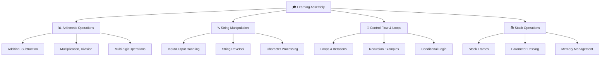
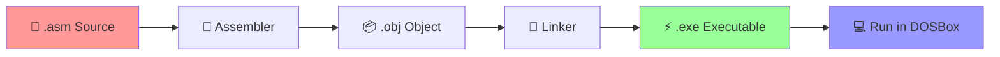
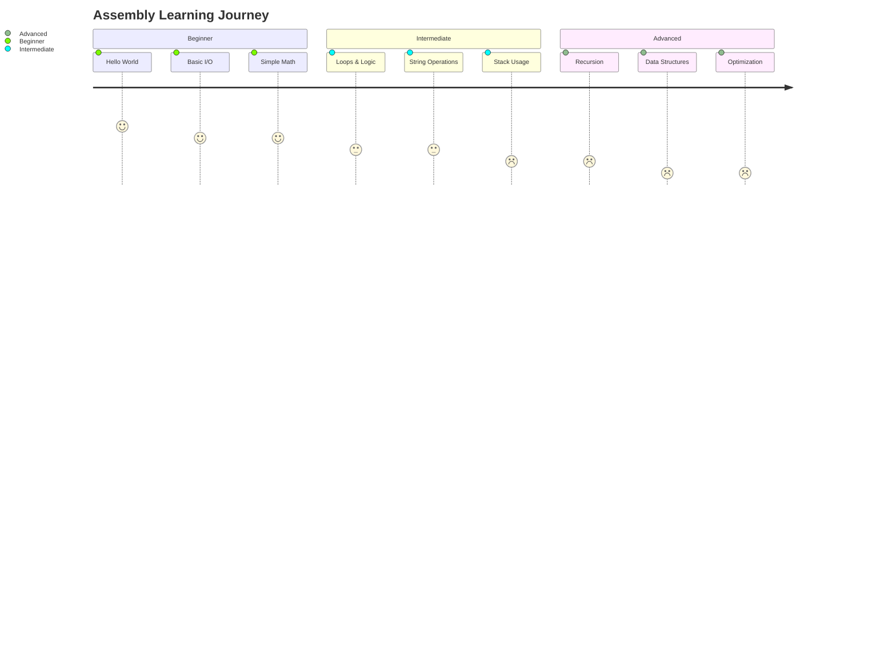

<div align="center">
  
</div>

<div align="center">

[](https://github.com/saadkhan/assembly-programs)
[](https://docs.microsoft.com/en-us/cpp/assembler/masm/)
[](https://en.wikipedia.org/wiki/X86)
[](https://www.dosbox.com/)

[](https://github.com/saadkhan/assembly-programs)
[](https://github.com/saadkhan/assembly-programs/fork)
[](https://github.com/saadkhan/assembly-programs/issues)
[](LICENSE)

</div>

<div align="center">
  
</div>

## 🎯 Overview

This repository contains a comprehensive collection of **Assembly Language** (`.asm`) programs designed for learning and mastering fundamental to advanced assembly concepts. The programs demonstrate **arithmetic operations**, **string manipulation**, **recursion**, **data structures**, **stack operations**, and **low-level system programming**.

Perfect for **Computer Science students**, **systems programmers**, and anyone interested in understanding how **high-level constructs** translate to **machine-level instructions**.

<div align="center">



</div>

## 📂 Program Categories

<details>
<summary><strong>🧮 Arithmetic Operations</strong></summary>

<div align="center">

| Program | Description | Concepts |
|---------|-------------|----------|
| `ADD_DISPLAYING.asm` | ➕ Adds two numbers and displays result | Basic arithmetic, output formatting |
| `SUBTRACTING_DISPLAYING.asm` | ➖ Subtracts two numbers and displays result | Subtraction, result handling |
| `MULTIPLYING_DISPLAYING.asm` | ✖️ Multiplies two numbers and displays result | Multiplication algorithms |
| `DIVIDING_DISPLAYING.asm` | ➗ Divides two numbers and displays result | Division, remainder handling |
| `MultiDigits_Add(without carry).asm` | 🔢 Multi-digit addition (no carry) | Array processing, digit manipulation |
| `MultiDigits_Add(carry).asm` | 🔢 Multi-digit addition with carry | Carry propagation, overflow handling |

</div>

</details>

<details>
<summary><strong>🔄 Loops & Recursion</strong></summary>

<div align="center">

| Program | Description | Concepts |
|---------|-------------|----------|
| `printing_0-9_loop.asm` | 🔢 Prints numbers 0-9 using loops | Loop structures, counter variables |
| `Recursion_Factorial.asm` | ♻️ Recursive factorial calculation | Recursion, stack management |
| `Recursion_Fibonacii.asm` | 🌀 Recursive Fibonacci generator | Advanced recursion, optimization |
| `fibonacci.asm` | 📈 Iterative Fibonacci sequence | Iterative algorithms, efficiency |

</div>

</details>

<details>
<summary><strong>🔢 Number Operations</strong></summary>

<div align="center">

| Program | Description | Concepts |
|---------|-------------|----------|
| `EVEN_ODD.asm` | ⚡ Even/odd number checker | Bitwise operations, modulo |
| `Min_Max_Mean.asm` | 📊 Min, max, mean from array | Array traversal, statistical operations |
| `Number_Comparison.asm` | ⚖️ Compares multiple numbers | Conditional jumps, comparison logic |
| `Factorial.asm` | 🧮 Factorial computation | Mathematical algorithms |

</div>

</details>

<details>
<summary><strong>🔤 String & Character Processing</strong></summary>

<div align="center">

| Program | Description | Concepts |
|---------|-------------|----------|
| `Displaying_String_Variable.asm` | 📝 Display string variables | String handling, memory access |
| `INPUT_OUTPUT_STRING.asm` | 💬 String input/output operations | I/O operations, buffer management |
| `Input_Output_of_Single_Character.asm` | 🔤 Single character I/O | Character processing, ASCII handling |
| `String_Reverse.asm` | 🔄 String reversal algorithm | String manipulation, indexing |
| `reversingString_Stack.asm` | 📚 Stack-based string reversal | Stack operations, LIFO principles |
| `Vowels_String.asm` | 🔍 Vowel processing in strings | Pattern matching, string parsing |
| `Encrpt_Dcrpt.asm` | 🔐 Text encryption/decryption | Cryptographic concepts, bit manipulation |

</div>

</details>

<details>
<summary><strong>📚 Stack Frame Examples</strong></summary>

<div align="center">

| Program | Description | Concepts |
|---------|-------------|----------|
| `StackFrame_AddTwoNumbers.asm` | ➕ Addition using stack frames | Stack frame setup, parameter passing |
| `StackFrame_SwapNumbers.asm` | 🔄 Number swapping with stack | Stack-based variable swapping |
| `StackFrame_CopyString.asm` | 📋 String copying via stack | Stack string operations, memory management |

</div>

</details>

<details>
<summary><strong>🔧 Utility & Miscellaneous</strong></summary>

<div align="center">

| Program | Description | Concepts |
|---------|-------------|----------|
| `Displaying_HelloWorld.asm` | 👋 Hello World program | Basic output, program structure |
| `palindrome.asm` | 🔄 Palindrome checker | String comparison, symmetry detection |
| `Tree.asm` | 🌳 Tree data structure | Data structures, tree traversal |
| `Swap_two_values.asm` | ↔️ Value swapping | Memory operations, temporary variables |
| `printing_ascii_tabl.asm` | 📋 ASCII table printer | Character encoding, table formatting |
| `Incrementing_Displaying.asm` | ⬆️ Increment and display | Loop counters, output formatting |
| `BITROLES.asm` | ⚙️ Bitwise role operations | Bit manipulation, logical operations |
| `BELLIRNGS.asm` | 🔔 Bell ringing simulation | ASCII art, timing operations |

</div>

</details>

## 🚀 Quick Start Guide

<div align="center">

### 🛠️ Prerequisites


</div>

### 📋 Installation & Setup

```bash
# Clone the repository
git clone https://github.com/saadkhan/assembly-programs.git
cd assembly-programs

# Install DOSBox (if not already installed)
# Windows: Download from https://www.dosbox.com/
# macOS: brew install dosbox
# Linux: sudo apt-get install dosbox
```

### ▶️ Running Programs

```bash
# Method 1: Using MASM in DOSBox
masm program_name.asm;
link program_name.obj;
program_name.exe

# Method 2: Using modern assembler (NASM)
nasm -f elf program_name.asm
ld -m elf_i386 program_name.o -o program_name
./program_name
```

<div align="center">

### 🎯 Program Execution Flow



</div>

## 📊 Repository Statistics

<div align="center">
  
</div>

<div align="center">

| Metric | Count | Description |
|--------|-------|-------------|
| 📁 **Total Programs** | 25+ | Complete assembly implementations |
| 🎯 **Categories** | 6 | Organized by functionality |
| 🧮 **Arithmetic Ops** | 6 | Basic to advanced math operations |
| 🔤 **String Programs** | 7 | Text processing and manipulation |
| 📚 **Stack Examples** | 3 | Stack frame implementations |
| 🔄 **Loop Examples** | 4 | Iteration and recursion demos |

</div>

## 🎓 Learning Path

<div align="center">



</div>

### 🎯 Recommended Study Order

1. **🟢 Beginner Level**
   - `Displaying_HelloWorld.asm`
   - `ADD_DISPLAYING.asm`
   - `Input_Output_of_Single_Character.asm`

2. **🟡 Intermediate Level**
   - `EVEN_ODD.asm`
   - `printing_0-9_loop.asm`
   - `String_Reverse.asm`

3. **🔴 Advanced Level**
   - `Recursion_Factorial.asm`
   - `StackFrame_AddTwoNumbers.asm`
   - `Tree.asm`

## 💡 Key Concepts Covered

<div align="center">

| Concept | Programs | Difficulty |
|---------|----------|-----------|
| **🔢 Basic I/O** | Hello World, Character I/O |  |
| **➕ Arithmetic** | Add, Subtract, Multiply, Divide |  |
| **🔄 Control Flow** | Loops, Conditionals |  |
| **🔤 String Handling** | Reverse, Encryption, Vowels |  |
| **📚 Stack Operations** | Stack Frames, Parameter Passing |  |
| **♻️ Recursion** | Factorial, Fibonacci |  |
| **🏗️ Data Structures** | Arrays, Trees |  |

</div>

## 🛡️ System Requirements

<div align="center">

| Component | Requirement | Notes |
|-----------|-------------|--------|
| **💻 OS** | Windows/Linux/macOS | DOSBox provides compatibility |
| **🔧 Assembler** | MASM, TASM, or NASM | MASM recommended for beginners |
| **🖥️ Architecture** | x86 (16-bit/32-bit) | Most programs are 16-bit |
| **💾 Memory** | Minimal (< 1MB) | Assembly programs are lightweight |
| **🎮 Emulator** | DOSBox (recommended) | For running 16-bit programs |

</div>

## 🤝 Contributing

<div align="center">

[](https://github.com/saadkhan/assembly-programs/graphs/contributors)
[](https://github.com/saadkhan/assembly-programs/issues)
[](https://github.com/saadkhan/assembly-programs/pulls)

</div>

### 🎯 How to Contribute

1. **🍴 Fork** the repository
2. **🌿 Create** a feature branch (`git checkout -b feature/new-program`)
3. **✏️ Add** your assembly program with proper documentation
4. **💾 Commit** your changes (`git commit -m 'Add new sorting algorithm'`)
5. **📤 Push** to the branch (`git push origin feature/new-program`)
6. **🔄 Create** a Pull Request

### 🎨 Contribution Guidelines

- ✅ **Comment your code** for educational clarity
- ✅ **Follow naming conventions** (descriptive filenames)
- ✅ **Test your programs** in DOSBox before submitting
- ✅ **Update README** if adding new categories
- ✅ **Include example output** in comments

## 📚 Educational Resources

<div align="center">

### 📖 Recommended Reading

[](https://example.com)
[](https://example.com)
[](https://docs.microsoft.com/en-us/cpp/assembler/masm/)

</div>

- 📗 **"Assembly Language Step-by-Step"** by Jeff Duntemann
- 📘 **"Programming from the Ground Up"** by Jonathan Bartlett  
- 📙 **"x86-64 Assembly Language Programming with Ubuntu"** by Ed Jorgensen
- 📕 **Intel x86 Architecture Manual** (Official Reference)

## 📄 License

<div align="center">

[](https://opensource.org/licenses/MIT)

This project is licensed under the **MIT License** - see the [LICENSE](LICENSE) file for details.

</div>

## 🙋‍♂️ Support & Contact

<div align="center">

[](https://github.com/saadkhan/assembly-programs/issues)
[](https://github.com/saadkhan/assembly-programs/discussions)
[](mailto:saad@example.com)

</div>

### 💬 Get Help

- 🐛 **Found a bug?** [Create an issue](https://github.com/saadkhan/assembly-programs/issues/new)
- 💡 **Have a suggestion?** [Start a discussion](https://github.com/saadkhan/assembly-programs/discussions)
- 📚 **Need help learning?** Check our [Wiki](https://github.com/saadkhan/assembly-programs/wiki)
- 💌 **Want to collaborate?** [Send an email](mailto:saad@example.com)

## ⭐ Show Your Support

<div align="center">

If this repository helped you learn assembly language, please consider:

[](https://github.com/saadkhan/assembly-programs)
[](https://github.com/saadkhan/assembly-programs/fork)
[](https://twitter.com/intent/tweet?text=Check%20out%20this%20awesome%20Assembly%20Language%20collection!&url=https://github.com/saadkhan/assembly-programs)

</div>

---

<div align="center">
  
  
  **Made with ❤️ for the Assembly Programming Community**
  
  ⭐ **Learning never stops - Keep coding!** | [Saad Khan](https://github.com/saadkhan) 🚀
</div>
